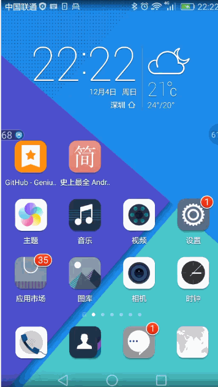

##主要是实现小火箭的效果
###功能

1.有小箭动画效果

2.动态显示内存使用率

###原理

这种桌面悬浮窗的效果很类似与Widget，但是它比Widget要灵活的多。主要是通过WindowManager这个类来实现的，调用这个类的addView方法用于添加一个悬浮窗，updateViewLayout方法用于更新悬浮窗的参数，removeView用于移除悬浮窗。其中悬浮窗的参数有必要详细说明一下。
WindowManager.LayoutParams这个类用于提供悬浮窗所需的参数，其中有几个经常会用到的变量：
type值用于确定悬浮窗的类型，一般设为2002，表示在所有应用程序之上，但在状态栏之下。
flags值用于确定悬浮窗的行为，比如说不可聚焦，非模态对话框等等，属性非常多，大家可以查看文档。
gravity值用于确定悬浮窗的对齐方式，一般设为左上角对齐，这样当拖动悬浮窗的时候方便计算坐标。
x值用于确定悬浮窗的位置，如果要横向移动悬浮窗，就需要改变这个值。
y值用于确定悬浮窗的位置，如果要纵向移动悬浮窗，就需要改变这个值。
width值用于指定悬浮窗的宽度。
height值用于指定悬浮窗的高度。

创建悬浮窗这种窗体需要向用户申请权限才可以的，因此还需要在AndroidManifest.xml中加入<uses-permission android:name="android.permission.SYSTEM_ALERT_WINDOW" />

###效果图

